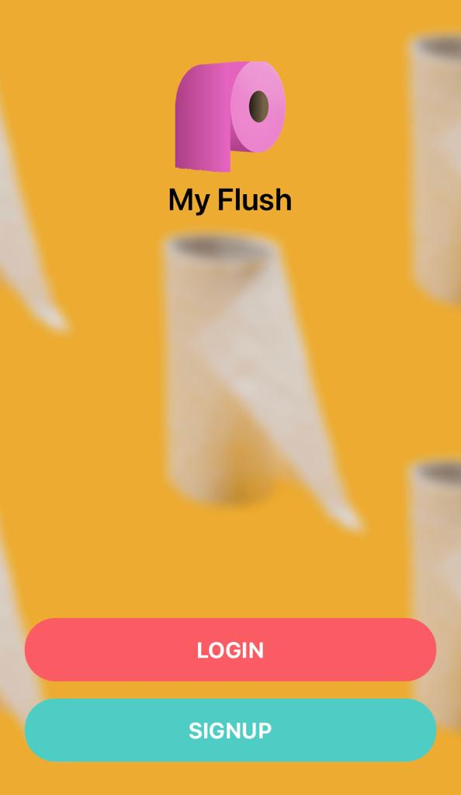

# [My Flush](https://github.com/germanokuerten/myflush-mobile)

Find and Flush! 

## What is MyFlush?

- MyFlush is a mobile application that helps you find restrooms near you. 🚽

## Technologies

- JavaScript 
- React Native
- Expo
- Node JS
- JWT Auth
- Lottie React Native
- Apisauce

Welcome screen            |  
:-------------------------:|
  |

## Future Enhancements

- Map navigation
- User can search by category
- User can post ratings, comments, on posts 
- User can direct message other users
- Edit and delete user's own postings

**Summary**

| Field | Detail |
|-------|--------|
| App Name | MyFlush - Find and Flush |
| Description | MyFlush is a mobile application that helps you find restrooms near you.  |
| Developers | Germano Kuerten |
| Repo | https://github.com/germanokuerten/myflush-mobile |

>"Simplicity is the ultimate sophistication." - Leonardo da Vinci